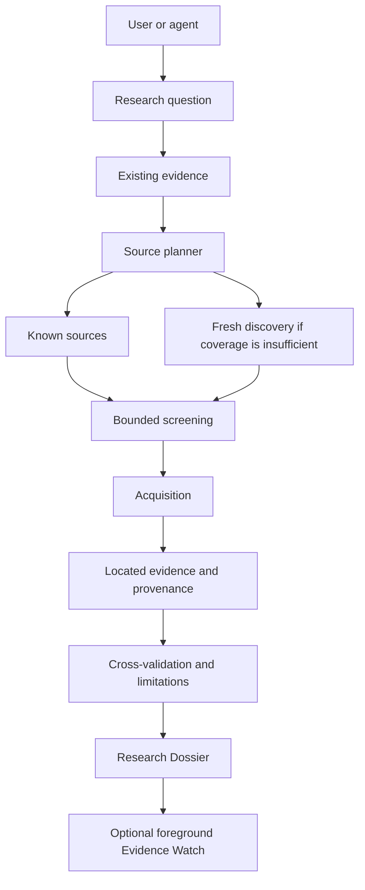

# Architecture

YouTube, GitHub, papers, standards, feeds, and web pages are sources behind the same research process. The local Store keeps versioned records and an audit chain under an exclusive single-process lease. Catalog reads are sequential within one invocation; independent account status need not take that lease. External source content is data. The engine never grants an agent authority to implement a dossier recommendation.

The public-query facade stores an explicit classified brief before network discovery. Existing registry candidates are ranked against the current question; when coverage is insufficient, a bounded part of the candidate budget is reserved for fresh search hits. The current 260 historical / 40 fresh allocation is an engineering parameter, not a universal optimal ratio. Resource safety checks remain active while redundant per-request repository scans are reduced.
